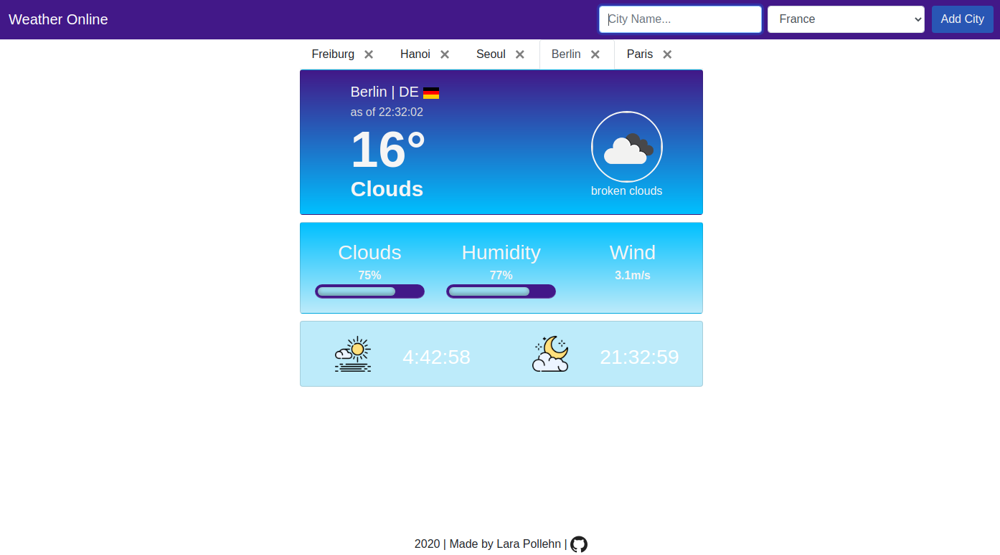
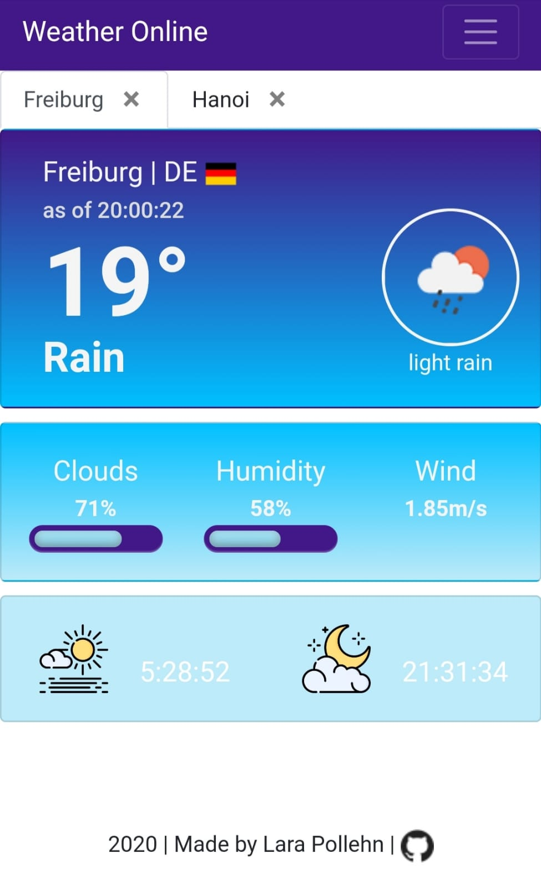

# Weather Online

This web app provides weather data for cities of your choice. 

The weather data gets fetched from OpenWeatherMap API and cached with redis. 

# Desktop
Desktop version on 1920 x 1080 monitor.

# Mobile
Smartphone version on Redmi Note 5.

